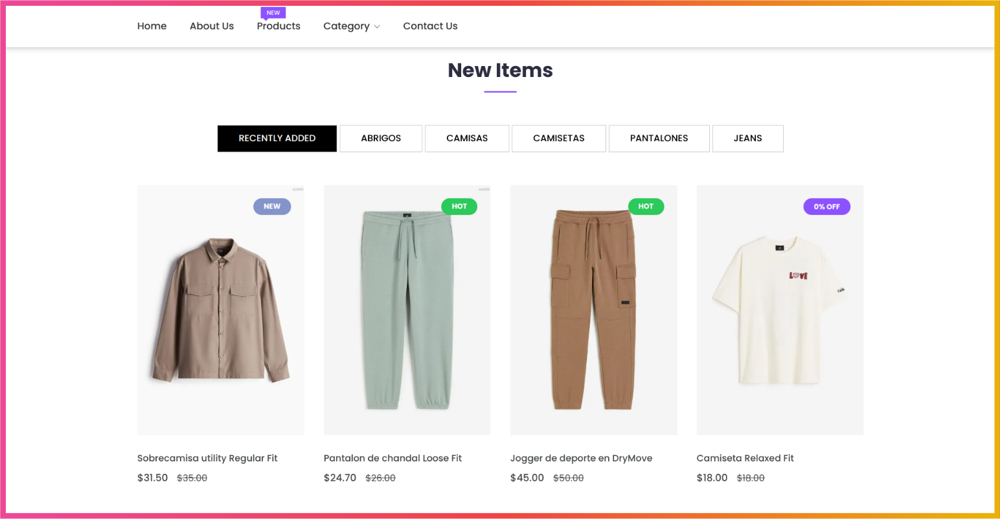

<div align="center">
  <!-- <a href="https://slug.vercel.app">
    
  </a> -->
  <p>
    <h2>
      SHOP - System of Online Products
    </b>
  </p>

<!-- <a href="https://slug.vercel.app/dashboard">Dashboard</a>
<span>&nbsp;&nbsp;❖&nbsp;&nbsp;</span>
<a href="#-roadmap">Roadmap</a>
<span>&nbsp;&nbsp;❖&nbsp;&nbsp;</span>
<a href="#-getting-started">Contribute</a>
<span>&nbsp;&nbsp;❖&nbsp;&nbsp;</span>
<a href="https://github.com/pheralb/slug/issues/new/choose">Create issue</a>
<span>&nbsp;&nbsp;❖&nbsp;&nbsp;</span>
<a href="https://twitter.com/pheralb_">X/Twitter</a> -->

<div align="center">
    
    </a>
    <p></p>
</div>


</div>

This PHP Laravel project features an attractive showcase of new, featured, and popular products. Users can browse through a curated selection of top products, organized into categories for easy exploration.

Whether it’s men’s fashion, women’s clothing, or other categories, customers can effortlessly find products tailored to their preferences, thanks to specific sorting options and category navigation. Categories are managed by the admin and can be adjusted as needed.

Each product displays both its original price and the discounted price, enhancing the shopping experience. The website provides all these sections to allow users to navigate and discover new products of interest.

## 📄 Table of Contents

-   [features](#features)
-   [Installation](#installation)
-   [Prerequisites](#prerequisites)
-   [Usage](#usage)
-   [Deployment](#deployment)
-   [License](#license)

## 🎉 Features

-   Customer Panel
-   Admin Panel
-   Top, Featured Products
-   Product Filter
-   Product Discounts
-   Coupon Code
-   Add to Cart
-   Add to Wish List
-   Order Tracking System
-   View Order
-   View Blogs
-   Comment on Blogs
-   Rate and Review Products
-   Manage Media, Banner
-   Product Category Management
-   Product Management
-   Order Management
-   Product Brand and Shipping Management
-   Upload Manager: Media Files
-   Website Settings
-   User Management
-   Coupon Management
-   Review and Comments Management
-   Notification for Admin
-   Earnings Overview
-   Profile Settings

## 📋 Prerequisites

-   PHP >= 8.3
-   Node.js >= 18.0
-   Composer
-   MySQL

## 🌱 Installation

1. Clone the repository:

    ```bash
    git clone https://github.com/geo-mena/shop.git
    ```

2. Navigate to the project directory:

    ```bash
    cd shop
    ```

3. Open the project folder, check for the `.env` file, and update the database credentials.
4. Create a MySQL database with the name provided inside the `.env` file.
5. Then, open the project in the *Terminal or Command Prompt.*
6. Install the Node.js dependencies:
    ```bash
    npm install
    ```
7. Install the Composer dependencies:
    ```bash
    composer install
    ```
8. Create a symbolic link to the storage folder:
    ```bash
    php artisan storage:link
    ```
9. For the database, you can either import the given SQL file or start a new one following the command lines.
10. Now migrate the tables:
    ```bash
    php artisan migrate
    ```
11. Run seeder:
    ```bash
    php artisan db:seed
    ```
12. Then generate the key:
    ```bash
    php artisan key:generate
    ```

## ⚡️ Usage

1.  To start the server:
    ```bash
    php artisan serve
    ```
2.  Open the browser and navigate to `http://localhost:8000` to view the project.

## 🚀 Deployment

1.  To compile the assets:
    ```bash
    npm run dev
    ```
2.  To compile the assets for production:
    ```bash
    npm run prod
    ```
3.  To clear the configuration cache:
    ```bash
    php artisan config:clear
    ```
4.  To clear the route cache:
    ```bash
    php artisan route:clear
    ```
5.  To clear the view cache:
    ```bash
    php artisan view:clear
    ```
6.  To clear the configuration and route cache:
    ```bash
    php artisan cache:clear
    ```
7.  To clear the configuration, route, and view cache:
    ```bash
    php artisan optimize:clear
    ```
    
## 📜 License

This project is licensed under the MIT License. See the [LICENSE](LICENSE) for more details.
